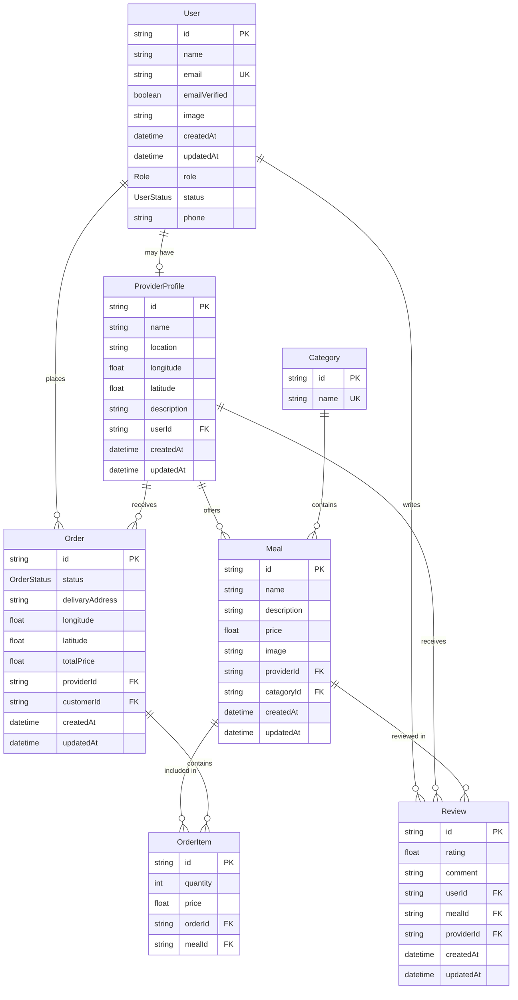

# FoodExpress

<p align="center">
  
</p>

**"Fast, Reliable, and Delicious – Delivered to Your Doorstep."**

FoodExpress is a premium food ordering platform that connects hungry customers with their favorite local providers. Built with a focus on speed, reliability, and a seamless user experience, FoodExpress is your go-to solution for satisfying every craving.

---
## Client Repository

The frontend client for this project is available at:
[https://github.com/amisadman/foodexpress-client](https://github.com/amisadman/foodexpress-client)

---

## Key Features

### For Customers

- **Intuitive Discovery**: Browse meals by category, cuisine, or restaurant.
- **Dynamic Cart**: Seamlessly add items, adjust quantities, and manage your order.
- **Live Tracking**: Real-time status updates from "Placed" to "Delivered".
- **Reviews & Ratings**: Share your dining experience with the community.

### For Restaurants

- **Menu Management**: Effortlessly add, edit, or remove meals.
- **Order Dashboard**: Manage incoming orders in real-time.
- **Status Control**: Keep customers updated with streamlined status transitions.

### For Admins

- **User Oversight**: Manage customer and provider statuses.
- **Category Control**: Organize the platform's menu hierarchy.
- **Analytics**: High-level overview of platform performance.

---

## Tech Stack

- **Framework**: [Node.js](https://nodejs.org/) & [Express](https://expressjs.com/)
- **Authentication**: [Better Auth](https://better-auth.com/)
- **Database**: [PostgreSQL](https://www.postgresql.org/)
- **ORM**: [Prisma](https://www.prisma.io/)

---

## Database Schema

Our database is designed for high performance and data integrity:



---

## Getting Started

### 1. Prerequisites

- Node.js (v18+)
- PostgreSQL Database

### 2. Installation

```bash
# Clone the repository
git clone https://github.com/amisadman/foodexpress-server.git

# Install dependencies
pnpm install
```

### 3. Environment Setup

Create a `.env` file in the root directory: use `.env.example`.

### 4. Database Migration

```bash
pnpm dlx prisma migrate dev --name init
```

### 5. Run the Application

```bash
pnpm dev
```

---
